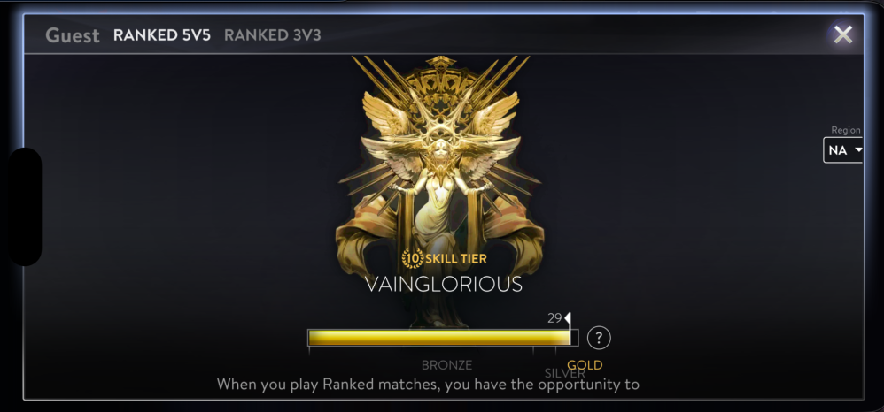
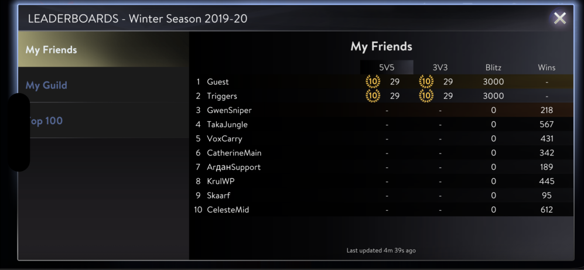
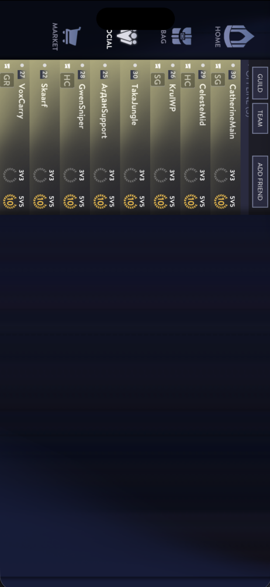
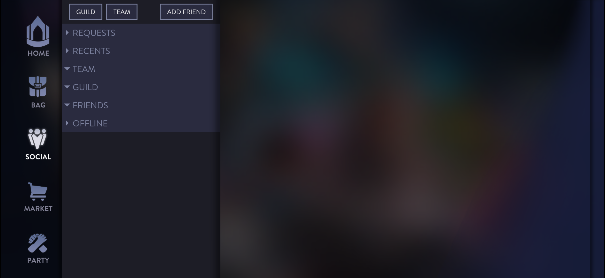
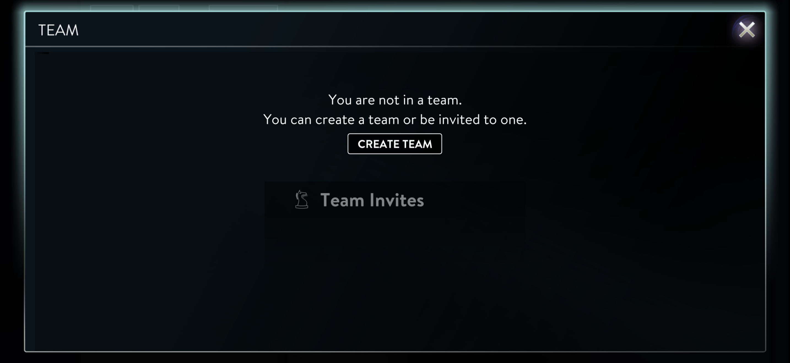
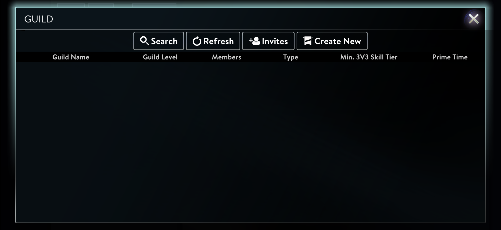
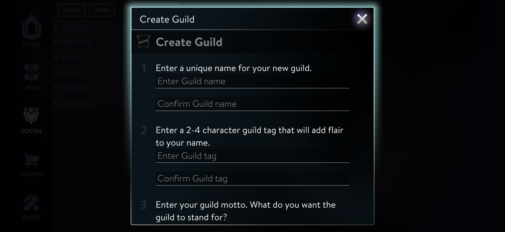
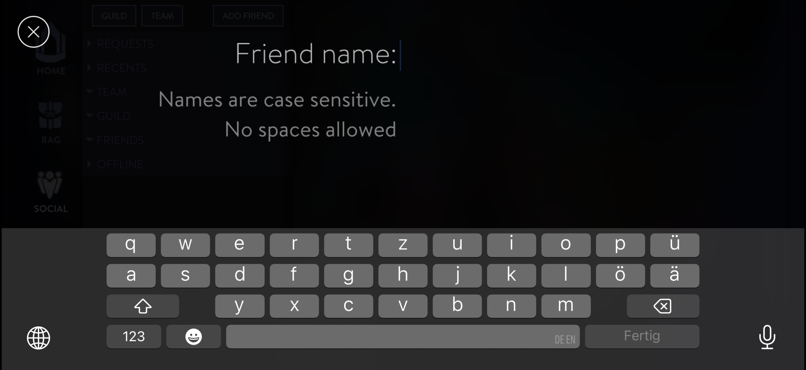
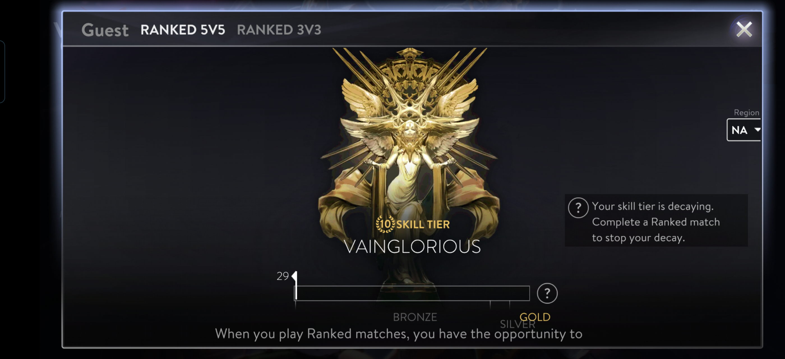

# HackedGlory

HackedGlory is a reverse-engineering archive and tooling workspace for the final Vainglory client, focused primarily on **GameKindred v4.13.4 / build 147219**. It combines Ghidra projects, decompiled output, static-analysis reports, runtime interception, protocol decoding, asset extraction, and targeted unlock libraries for iOS and Android experiments.

Community updates: [EU Discord](https://discord.gg/5Y3q7cTH)

This is a research repository, not a polished mod distribution. Most results are useful because they explain how the Community Edition client was gated, what still exists in the binary, and which parts can be safely inspected or re-enabled under controlled test conditions.

## Contents

- [Status At A Glance](#status-at-a-glance)
- [Where To Start](#where-to-start)
- [Restored Surfaces](#restored-surfaces)
- [Major Findings](#major-findings)
- [Ghidra And Decompiled Output](#ghidra-and-decompiled-output)
- [Runtime MITM And Match Decoding](#runtime-mitm-and-match-decoding)
- [Unlock Libraries](#unlock-libraries)
- [Assets And Balance Data](#assets-and-balance-data)
- [Repository Layout](#repository-layout)
- [Common Workflows](#common-workflows)
- [Tooling And Environment](#tooling-and-environment)
- [Open Work](#open-work)
- [License](#license)

## Status At A Glance

| Area | Current state | Main entry points |
| --- | --- | --- |
| CE feature gate | Master gate mapped to 164 BL instructions across 92 unique functions. Direct global patching is unsafe; targeted hooks are the useful path. | [`reports/ce_gate_analysis.md`](reports/ce_gate_analysis.md) |
| iOS unlock work | Sidebar/profile/ranked/social/leaderboard surfaces can be forced visible for inspection through `vg_unlock.dylib`. | [`mitm/vg_unlock/`](mitm/vg_unlock/) |
| Android unlock work | Loader-shim injection is the supported package patching path. Control builds are safe by default; patch groups must be enabled intentionally. A parity-oriented hook set has been validated on the primary Honor Android 16 target, with remaining offset work documented. | [`mitm/vg_unlock_android/README.md`](mitm/vg_unlock_android/README.md), [`scripts/android/README.md`](scripts/android/README.md) |
| Platform JSON-RPC | Auth/session/profile/social/party/guild/inventory/content surfaces are inferred from static strings, Ghidra traces, and MITM captures. | [`reports/vainglory_static_report.md`](reports/vainglory_static_report.md), [`reports/method_schema_sheet.md`](reports/method_schema_sheet.md), [`reports/offline_protocol_surface.md`](reports/offline_protocol_surface.md) |
| In-match protocol | TCP framing, Blowfish ECB, and per-match key derivation are decoded. Higher-level scoreboard replay decoding is actively benchmarked. | [`reports/protocol_decryption_writeup.md`](reports/protocol_decryption_writeup.md), [`mitm/match_decryption/`](mitm/match_decryption/) |
| Match replay semantics | Latest recorded autoresearch metrics decode useful scoreboard state across 7 full matches: winner signal for 7/7, gold and XP for 42/42 active players, death timelines for 41/42, kills for 27 players, level-ups for 35 players, and replay-ready rows for 41 players. | [`mitm/match_decryption/autoresearch.md`](mitm/match_decryption/autoresearch.md) |
| CFF0 balance data | Client-side gameplay definitions are located, decrypted, and extracted into generated balance databases. | [`reports/cff0_decryption_and_balance_extraction.md`](reports/cff0_decryption_and_balance_extraction.md), [`reports/generated/vainglory_balance_db.json`](reports/generated/vainglory_balance_db.json) |
| Assets and meshes | RSC0/CFF0 asset structure is documented. Texture and mesh extraction tooling exists, with many extracted OBJ/WebP artifacts committed for inspection. | [`reports/3d_mesh_extraction.md`](reports/3d_mesh_extraction.md), [`reports/hero_assets_inventory.md`](reports/hero_assets_inventory.md) |
| Decompiled corpus | Ghidra projects and generated C-like output for iOS `GameKindred` and Android `libGameKindred.so` are committed, including structured split output. | [`ghidra_projects/`](ghidra_projects/), [`ghidra_scripts/`](ghidra_scripts/) |

## Where To Start

Use the top-level reports first, then drop into the specific tooling directories.

- For "what did CE disable?", start with [`reports/ce_gate_analysis.md`](reports/ce_gate_analysis.md).
- For "how does the in-match protocol decrypt?", start with [`reports/protocol_decryption_writeup.md`](reports/protocol_decryption_writeup.md).
- For "what can the client ask the backend for?", start with [`reports/method_schema_sheet.md`](reports/method_schema_sheet.md) and [`reports/offline_protocol_surface.md`](reports/offline_protocol_surface.md).
- For "how do I capture or inspect traffic?", start with [`mitm/README.md`](mitm/README.md).
- For "how do I inspect replay-like match state?", start with [`mitm/match_decryption/autoresearch.md`](mitm/match_decryption/autoresearch.md).
- For "where are hero stats, items, talents, and game modes?", start with [`reports/cff0_decryption_and_balance_extraction.md`](reports/cff0_decryption_and_balance_extraction.md).
- For "what is the Android injection status?", start with [`mitm/vg_unlock_android/README.md`](mitm/vg_unlock_android/README.md) and [`scripts/android/README.md`](scripts/android/README.md).

Older notes may preserve earlier hypotheses. When documents disagree, prefer the newer targeted writeups listed above over broad inventory files.

## Restored Surfaces

The current unlock work can surface UI that stock Community Edition hides or suppresses. These screenshots are inspection evidence, not a claim that every restored panel is fully backed by live server data.

<p>
  
  
  
</p>
<p>
  
  
  
</p>
<p>
  
  
  
</p>

Android parity-oriented screenshots from the Honor Magic 6 Pro test target:

<p>
  
  
</p>

## Major Findings

### Community Edition Gate

Community Edition relies on a central gate function, `FUN_100131560`, that hardcodes `return 1`. Static analysis currently maps it to **164 BL instructions across 92 unique functions**.

That is the core reason CE looks "removed" at the UI level even when many systems still exist in the binary. The gate participates in sidebar/tab registration, profile and ranked views, party/social/guild surfaces, market and reward displays, leaderboard flows, seasons, queue/play paths, and replay/spectate-adjacent code.

The practical result:

- A global patch of the gate is too broad and activates dependent paths that are not ready.
- Targeted hooks are more reliable than pretending every gated caller has the same preconditions.
- Some UI needs only visibility or registration changes.
- Some UI needs data-population hooks or backend payloads that CE no longer requests.
- Android needs separate offset and layout verification; iOS offsets cannot be copied blindly.

See [`reports/ce_gate_analysis.md`](reports/ce_gate_analysis.md) for the function-level map, hook inventory, and priority list.

### Menu And UI Control

The E.V.I.L. engine menu system is now documented well enough to follow several screens from network/state inputs to visible panels. The current reports cover event hashes, panel switching, localization lookups, friends-list parsing, leaderboard data flow, feature flags, and control points for patching.

Start with [`reports/menu_ui_control_guide.md`](reports/menu_ui_control_guide.md). Generated supporting traces live in [`reports/generated/sidebar_trace.md`](reports/generated/sidebar_trace.md), [`reports/generated/sidebar_gates.md`](reports/generated/sidebar_gates.md), [`reports/generated/leaderboard_analysis.md`](reports/generated/leaderboard_analysis.md), and [`reports/generated/ui_event_dispatch.md`](reports/generated/ui_event_dispatch.md).

### Platform Surface

The client strongly appears to use HTTPS JSON-RPC for authentication, session bootstrap, social, party, guild, profile, ranked, inventory, manifest, and matchmaking flows. The repo includes method clusters, inferred schemas, field sheets, network traces, and a mock server skeleton.

Important references:

- [`reports/vainglory_static_report.md`](reports/vainglory_static_report.md): broad static report over hosts, methods, strings, and data shapes
- [`reports/method_schema_sheet.md`](reports/method_schema_sheet.md): grouped method and payload field notes
- [`reports/offline_protocol_surface.md`](reports/offline_protocol_surface.md): practical offline/mockability assessment
- [`reports/generated/rpc_schema_report.md`](reports/generated/rpc_schema_report.md) and [`reports/generated/rpc_schemas.json`](reports/generated/rpc_schemas.json): generated schema artifacts
- [`scripts/mock_platform_server.py`](scripts/mock_platform_server.py): local mock/stub server for controlled JSON-RPC experiments

### In-Match Transport

The current best transport explanation is:

- 2-byte big-endian TCP framing
- Blowfish ECB encryption
- per-match key derivation using `MD5(salt + match_id)`
- ARM64 little-endian word-order handling in the client implementation
- decoded opcode surface with working packet analysis, dashboards, and match summaries

The authoritative writeup is [`reports/protocol_decryption_writeup.md`](reports/protocol_decryption_writeup.md). Some older protocol notes preserve earlier XOR or partial-transport hypotheses; treat the Blowfish/MD5 writeup as the current result.

### Scoreboard Replay Decoding

The match-decryption work has moved beyond "can packets decrypt?" into replay-usable match state. The active benchmark focuses on scoreboard state over time: levels, kills, deaths, creep score, total gold, total XP, and winner signals.

Latest recorded autoresearch metrics in [`mitm/match_decryption/autoresearch.jsonl`](mitm/match_decryption/autoresearch.jsonl) show:

- `scoreboard_score=7032`
- `scored_matches=7`
- `winner_matches=7`
- `gold_players=42`, `xp_players=42`
- `death_timeline_players=41`, `death_players=30`
- `kill_players=27`, `total_kills=110`
- `cs_players=18`, `total_cs=361`
- `level_players=35`, `total_level_ups=86`
- `replay_players=41`
- broader diagnostics include positions for 41 players, talent-choice signals for 41 players, ability-like trigger signals for 16 players, and 780 tracked non-player world-position entities

These are heuristic replay metrics, not ground truth. The value is that the heuristics are repeatable across the committed capture corpus and are benchmarked with explicit regression metrics.

## Ghidra And Decompiled Output

Ghidra is the static-analysis backbone of the repository. The current repo includes both scripts and generated decompiler output, which makes it possible to inspect many findings without rebuilding the projects locally.

### Projects And Outputs

- [`ghidra_projects/GameKindred_decompile.gpr`](ghidra_projects/GameKindred_decompile.gpr): iOS Mach-O project
- [`ghidra_projects/GameKindred_decompile_output/GameKindred.c`](ghidra_projects/GameKindred_decompile_output/GameKindred.c): whole-program iOS decompiler output
- [`ghidra_projects/GameKindred_decompile_output/structured/`](ghidra_projects/GameKindred_decompile_output/structured/): split iOS output by functions, classes, headers, and UI-oriented groupings
- [`ghidra_projects/GameKindred_android_decompile.gpr`](ghidra_projects/GameKindred_android_decompile.gpr): Android `libGameKindred.so` project
- [`ghidra_projects/GameKindred_android_decompile_output/libGameKindred.c`](ghidra_projects/GameKindred_android_decompile_output/libGameKindred.c): whole-program Android decompiler output
- [`ghidra_projects/GameKindred_android_decompile_output/structured/`](ghidra_projects/GameKindred_android_decompile_output/structured/): split Android output
- [`ghidra_scripts/DecompileAllToC.java`](ghidra_scripts/DecompileAllToC.java) and [`ghidra_scripts/DecompileAndroidToC.java`](ghidra_scripts/DecompileAndroidToC.java): export scripts

### Analysis Scripts

The [`scripts/`](scripts/) directory contains targeted Ghidra automation and parsers used to produce the reports. Representative categories:

- Gate and UI tracing: `GhidraFindFeatureConsumers.java`, `GhidraVisibilityGates.java`, `GhidraSidebarTrace.java`, `GhidraSidebarGates.java`
- Profile/ranked/trophy work: `GhidraProfile*.java`, `GhidraTrophy*.java`, `GhidraSkillTierAnalysis.java`
- Protocol and networking: `GhidraMatchProtocol.java`, `GhidraGameConnect.java`, `GhidraFindGameTCP*.java`, `GhidraRpcSchemaExtractor.java`
- CFF0/balance extraction: `GhidraCFF0Analysis.java`, `GhidraCFF0Deep.java`, `decrypt_cff0.py`, `extract_balance_db.py`
- Android offset recovery: [`scripts/android/`](scripts/android/)

The workflow is intentionally split:

- Ghidra discovers code paths, function pointers, field offsets, and candidate protocol structures.
- Python scripts turn extracted data into reports, JSON inventories, decoded matches, and dashboards.
- MITM/runtime tooling validates static hypotheses against real client behavior.
- Unlock libraries apply narrow hooks only after a path is understood well enough to test.

## Runtime MITM And Match Decoding

Runtime tooling lives primarily under [`mitm/`](mitm/). The MITM stack captures and modifies platform JSON-RPC traffic, redirects DNS in controlled environments, proxies raw game TCP sessions, and records per-match packet captures.

Key components:

- [`mitm/vg_interceptor.py`](mitm/vg_interceptor.py): mitmproxy addon for JSON-RPC logging, categorization, response patching, and match proxy setup
- [`mitm/vg_game_proxy.py`](mitm/vg_game_proxy.py): raw TCP game-server proxy
- [`mitm/vg_dns.py`](mitm/vg_dns.py): DNS redirection helper
- [`mitm/vg_log_viewer.py`](mitm/vg_log_viewer.py): CLI JSONL viewer
- [`mitm/vg_jsonl_viewer.py`](mitm/vg_jsonl_viewer.py): browser JSONL viewer
- [`mitm/vg_dashboard_server.py`](mitm/vg_dashboard_server.py) and [`mitm/vg_match_dashboard.py`](mitm/vg_match_dashboard.py): match/dashboard helpers
- [`mitm/matches/`](mitm/matches/): captured packet artifacts
- [`mitm/match_decryption/`](mitm/match_decryption/): focused match-decryption workspace, dashboard, evaluator, decoded captures, and autoresearch notes

The classic MITM flow is documented in [`mitm/README.md`](mitm/README.md). It uses DNS spoofing, two `mitmdump` listeners, a fishhook SSL bypass on iOS, and a dynamic TCP proxy for in-match traffic.

## Unlock Libraries

### iOS

The iOS unlock library lives in [`mitm/vg_unlock/`](mitm/vg_unlock/). It targets the `GameKindred` Mach-O and implements narrow runtime hooks for restored UI inspection.

Currently documented restored/inspectable surfaces include:

- sidebar panels such as Academy, Party, and Social
- Bag and trophy-related UI paths
- full profile card surfaces, including currency/profile/ranked/stat elements
- ranked and stats tabs
- leaderboard visibility and profile-adjacent social surfaces

Some of these views are visibility-complete but data-incomplete. If a panel depends on a backend response CE never requests, unlocking the panel is only the first step.

### Android

The Android port lives in [`mitm/vg_unlock_android/`](mitm/vg_unlock_android/) and targets `libGameKindred.so`.

The supported injection mode is the loader-shim path:

- rename stock `lib/arm64-v8a/libGameKindred.so` to `libGameKindred_real.so`
- install a shim as `libGameKindred.so`
- have the shim load the real library and then `libvg_unlock.so`
- forward exported `Java_*` JNI entrypoints through the shim
- avoid smali edits and avoid the legacy `DT_NEEDED` rewrite by default

Important Android caveats:

- The default Android build is a control build with all patch groups disabled.
- Patch groups are intentionally opt-in via build flags such as `--parser-patches`, `--profile-redirects`, `--guest-bypass`, and `--experimental-hooks`.
- The legacy `DT_NEEDED` rewrite path is blocked by default because it has produced launch crashes on at least one tested device.
- iOS field offsets do not transfer directly. Confirmed Android layout differences are documented in the Android README and Ghidra notes.
- Primary tested parity target: Honor Magic 6 Pro / BVL-N49 on Android 16.
- Xiaomi Pad 6 testing showed why the loader-shim path is the only supported injection mode.

Build and patch details are in [`mitm/vg_unlock_android/README.md`](mitm/vg_unlock_android/README.md).

## Assets And Balance Data

The asset and data side has grown into its own research layer.

### CFF0 Gameplay Definitions

Gameplay balance data is stored client-side in CFF0 files under `Payload/GameKindred.app/Data/`, not fetched as ordinary live backend data at runtime. The current CFF0 work documents:

- 942 CFF0 definition files
- 48,187 total files in the app `Data/` tree
- encrypted `INST` sections, `DEF0` metadata, `PTCH` relocation records, and `SYMB` names
- XOR-stream decryption keyed from a client-side key table
- extracted heroes, items, talents, game modes, manifests, stores, minions, tutorials, and effects

Key outputs:

- [`reports/cff0_decryption_and_balance_extraction.md`](reports/cff0_decryption_and_balance_extraction.md)
- [`reports/generated/hero_balance_data.json`](reports/generated/hero_balance_data.json)
- [`reports/generated/vainglory_balance_db.json`](reports/generated/vainglory_balance_db.json)
- [`scripts/decrypt_cff0.py`](scripts/decrypt_cff0.py)
- [`scripts/extract_balance_db.py`](scripts/extract_balance_db.py)

### Hidden Heroes And Manifest Work

[`reports/adding_hidden_heroes_to_manifest.md`](reports/adding_hidden_heroes_to_manifest.md) documents the HeroManifest structure, CFF0 encryption/decryption path, and the tasks required to add hidden heroes to the manifest safely.

### RSC0 Assets, Textures, And Meshes

RSC0 containers hold much of the art/resource surface, including shaders, models, and texture references. Current extraction work includes:

- [`reports/3d_mesh_extraction.md`](reports/3d_mesh_extraction.md): RSC0 mesh format notes and extraction attempts
- [`reports/hero_assets_inventory.md`](reports/hero_assets_inventory.md): current state of hero portraits, atlases, app bundle assets, and external image options
- [`reports/extracted_assets/`](reports/extracted_assets/): generated atlas/texture samples
- [`extracted_meshes/`](extracted_meshes/): committed OBJ extraction experiments
- [`scripts/extract_meshes_v2.py`](scripts/extract_meshes_v2.py), [`scripts/rsc0_mesh_extractor.py`](scripts/rsc0_mesh_extractor.py), [`scripts/extract_textures.py`](scripts/extract_textures.py), and [`scripts/slice_atlas.py`](scripts/slice_atlas.py)

Texture and mesh extraction is useful but still incomplete. The reports are explicit about what renders correctly, what is only partially understood, and which parser assumptions are still being tested.

## Repository Layout

| Path | Purpose |
| --- | --- |
| [`reports/`](reports/) | Human-readable findings, investigation summaries, and generated report artifacts |
| [`reports/generated/`](reports/generated/) | Machine-generated inventories, schema reports, traces, and extracted JSON/TXT artifacts |
| [`reports/decoded_matches/`](reports/decoded_matches/) | Decoded packet logs and per-match summaries promoted from match-decryption work |
| [`mitm/`](mitm/) | Runtime traffic capture, response modification, dashboards, DNS/proxy helpers, and unlock libraries |
| [`mitm/match_decryption/`](mitm/match_decryption/) | Focused in-match protocol workspace with decoder, dashboard, benchmark, captures, and autoresearch logs |
| [`mitm/vg_unlock/`](mitm/vg_unlock/) | iOS unlock dylib source and build helper |
| [`mitm/vg_unlock_android/`](mitm/vg_unlock_android/) | Android unlock library, loader shim, package patcher, and Android README |
| [`scripts/`](scripts/) | Ghidra scripts, decoders, parsers, asset extractors, Frida helpers, and mock server tooling |
| [`scripts/android/`](scripts/android/) | Android-specific Ghidra offset verification helpers |
| [`ghidra_projects/`](ghidra_projects/) | Ghidra project files and committed decompiler exports for iOS and Android |
| [`ghidra_scripts/`](ghidra_scripts/) | Headless decompiler export scripts |
| [`images/`](images/) | README screenshots and restored-surface evidence |
| [`extracted_meshes/`](extracted_meshes/) | OBJ mesh extraction experiments |
| [`Payload/`](Payload/) | Local extracted iOS app payload used by analysis scripts |

## Common Workflows

### Inspect Generated Reports

Most high-level questions can be answered without running tools:

```sh
open reports/ce_gate_analysis.md
open reports/protocol_decryption_writeup.md
open reports/cff0_decryption_and_balance_extraction.md
open reports/menu_ui_control_guide.md
```

### Run The MITM Stack

Follow [`mitm/README.md`](mitm/README.md). The short version is:

```sh
cd mitm
sudo python3 vg_dns.py --host-ip 192.168.64.1
```

Then run the two documented `mitmdump` reverse proxies for ports `8000` and `443` with `vg_interceptor.py`.

### Inspect JSON-RPC Logs

```sh
cd mitm
python3 vg_jsonl_viewer.py --file vg_traffic.jsonl --open
```

### Run The Match Decoder Benchmark

```sh
cd mitm/match_decryption
./autoresearch.sh
```

This prints `METRIC ...` lines for scoreboard replay coverage and broader useful-parse diagnostics.

### Decode Match Captures

```sh
cd mitm/match_decryption
python3 scripts/decode_match_packets.py matches/<capture_dir>/packets.bin
```

Use the dashboard helpers in the same directory for higher-level match-state inspection.

### Build Android Unlock Artifacts

Default control build:

```sh
cd mitm/vg_unlock_android
./build.sh
```

Targeted testing build:

```sh
cd mitm/vg_unlock_android
./build.sh --experimental-hooks --parser-patches --profile-redirects --guest-bypass
```

Patch an XAPK through the loader shim:

```sh
python3 mitm/vg_unlock_android/patch_xapk.py /path/to/Vainglory_4.13.4.xapk --sign-debug
```

Read [`mitm/vg_unlock_android/README.md`](mitm/vg_unlock_android/README.md) before enabling patch groups.

### Extract Balance Data

```sh
python3 scripts/decrypt_cff0.py
python3 scripts/extract_balance_db.py
```

Check the generated files under [`reports/generated/`](reports/generated/).

## Tooling And Environment

Commonly used tools:

- macOS for iOS Mach-O analysis and existing local Ghidra workflows
- Python 3
- Ghidra 12.x
- mitmproxy / `mitmdump`
- Frida for dynamic instrumentation helpers
- Android NDK for `mitm/vg_unlock_android`
- controlled iOS VM/device and Android test devices for runtime validation

There is no single bootstrap command for the whole repo. The project is organized by research layer:

- static analysis in `scripts/`, `ghidra_scripts/`, `ghidra_projects/`, and `reports/`
- runtime capture and validation in `mitm/`
- in-match protocol decoding in `mitm/match_decryption/`
- platform-specific unlock experiments in `mitm/vg_unlock/` and `mitm/vg_unlock_android/`
- asset and balance extraction through `scripts/` plus `reports/generated/`

## Open Work

Current technical frontiers:

- find stronger, independent validation for match winner signals beyond the late `1077` burst
- improve creep-score decoding without loosening noisy farm/reward heuristics
- map hero assignment and item purchases more directly in the in-match protocol
- identify exact health/mana/current-resource fields and richer C->S input semantics
- finish Android verification for unresolved function pointers and field offsets
- separate Android-safe default hooks from parity/experimental hooks more cleanly in documentation and builds
- continue RSC0 texture/mesh parsing until assets can be extracted and rendered with fewer manual assumptions
- expand the mock platform server from inferred schemas into a practical offline client bootstrap harness

## License

This project is released under the [MIT License](https://opensource.org/licenses/MIT).

Permission is hereby granted, free of charge, to any person obtaining a copy of this software and associated documentation files, to deal in the software without restriction, including without limitation the rights to use, copy, modify, merge, publish, distribute, sublicense, and/or sell copies of the software, subject to the following conditions:

The above copyright notice and this permission notice shall be included in all copies or substantial portions of the software.

THE SOFTWARE IS PROVIDED "AS IS", WITHOUT WARRANTY OF ANY KIND, EXPRESS OR IMPLIED, INCLUDING BUT NOT LIMITED TO THE WARRANTIES OF MERCHANTABILITY, FITNESS FOR A PARTICULAR PURPOSE AND NONINFRINGEMENT.
