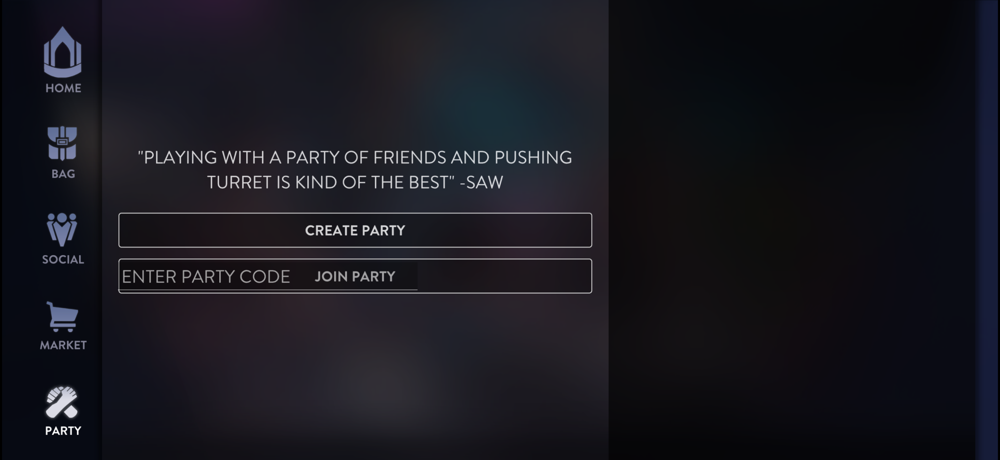
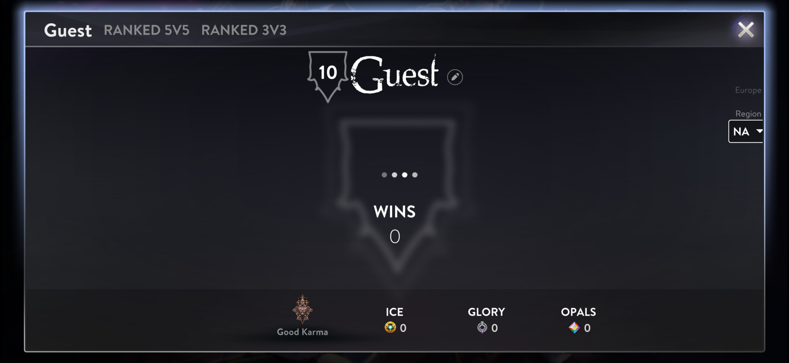

# HackedGlory

## Table of Contents

- [Feature Overview](#feature-overview)
- [Summary](#summary)
- [CE Gate Analysis](#ce-gate-analysis)
- [What This Repo Is](#what-this-repo-is)
- [Current Headline Findings](#current-headline-findings)
- [Important Note About The Reports](#important-note-about-the-reports)
- [Repository Layout](#repository-layout)
- [Recommended Reading Order](#recommended-reading-order)
- [How To Use This Repo](#how-to-use-this-repo)
- [Tooling And Environment](#tooling-and-environment)
- [Data Included In The Repo](#data-included-in-the-repo)
- [Android Port — Offset Verification Status](#android-port--offset-verification-status)
- [License](#license)

## Feature Overview

Current status at a glance:

- Socials UI can now be surfaced and inspected.
- Rank-related UI can now be surfaced and inspected.
- Leaderboard UI can now be surfaced and inspected.
- Party, Academy, and Trophies panels restored in the sidebar and bag tabs.
- Full profile card re-enabled (ICE, Glory, Opals, Karma, level shield, XP bar).
- The match protocol is now partially decrypted and documented.
- An Android (arm64) port of the unlock dylib is in progress.

### Screenshots

  
  
  

  
  
  

  
  
  

  
  

## Summary

This repository is a research archive for understanding how the final iOS version of **Vainglory** worked under the hood.:

- notes that explain what the game client appears to send to servers
- tools for capturing and inspecting traffic in a controlled test setup
- reverse-engineering scripts used to study the app binary
- sample decoded data and reports showing what has already been figured out

If you are not technical, the most useful takeaway is this: the repo is trying to document how the game's old online systems were structured so the behavior can be studied, archived, and potentially reproduced in controlled environments.

Start with [`reports/protocol_decryption_writeup.md`](reports/protocol_decryption_writeup.md) for the biggest result and [`reports/vainglory_static_report.md`](reports/vainglory_static_report.md) for the broad overview.

## CE Gate Analysis

The Community Edition gate function (`FUN_100131560`) is a single hardcoded `return 1` that disables features across 92 functions via 164 call sites. The unlock dylib systematically bypasses this gate across 9 layers — from feature flag parsing through sidebar panel registration, profile card restoration, and trophy data population.

For the full breakdown of every hooked function, which UI elements are restored, and what remains to be done, see [`reports/ce_gate_analysis.md`](reports/ce_gate_analysis.md).

## What This Repo Is

`HackedGlory` is a mixed research and tooling repository focused on the Vainglory iOS client (`GameKindred` v4.13.4).

The repo combines four kinds of material:

1. Static reverse-engineering notes from Ghidra-based analysis.
2. Runtime traffic-capture tooling for JSON-RPC and in-match traffic.
3. Decoding and protocol-analysis scripts.
4. Generated reports and sample captures that preserve the investigation results.

This is not a polished product. It is a working archive of findings, helper tooling, and evidence.

## Current Headline Findings

- The client platform layer appears to use HTTPS JSON-RPC for auth, matchmaking, profile, social, and content flows.
- The repo contains a broad inferred RPC surface, including account, party, guild, inventory, ranked, and session methods.
- The in-match protocol has been substantially decoded and documented.
- Sample captured matches and generated summaries are included in the repo.
- The MITM tooling can log, inspect, and modify selected platform responses in a controlled setup.

## Important Note About The Reports

This repo includes the history of the investigation, not just the final conclusion.

Some older documents describe the in-match encryption as an XOR-based scheme. The newer writeup in [`reports/protocol_decryption_writeup.md`](reports/protocol_decryption_writeup.md) documents the later and stronger conclusion: a Blowfish-based design with per-match key derivation and ARM64-specific endianness handling. When documents disagree, treat the newer writeup as the current best explanation and the older documents as useful historical context.

## Repository Layout

### `reports/`

Long-form documentation, findings, generated inventories, and decoded match summaries.

Good starting points:

- [`reports/vainglory_static_report.md`](reports/vainglory_static_report.md): first-pass static overview of the client, hosts, and likely RPC methods
- [`reports/vainglory_deep_inventory.md`](reports/vainglory_deep_inventory.md): expanded artifact inventory and network-architecture hypothesis
- [`reports/method_schema_sheet.md`](reports/method_schema_sheet.md): method-oriented interpretation of the inferred JSON-RPC surface
- [`reports/match_protocol_spec.md`](reports/match_protocol_spec.md): earlier technical spec for the in-match wire protocol
- [`reports/protocol_decryption_writeup.md`](reports/protocol_decryption_writeup.md): deepest protocol result in the repo
- [`reports/menu_ui_control_guide.md`](reports/menu_ui_control_guide.md), [`reports/trophy_investigation_summary.md`](reports/trophy_investigation_summary.md), [`reports/ce_gate_analysis.md`](reports/ce_gate_analysis.md): focused subsystem investigations
- [`reports/generated/`](reports/generated): machine-generated inventories, extracted clues, and protocol JSON
- [`reports/decoded_matches/`](reports/decoded_matches): decoded packet logs and per-match summaries

### `scripts/`

Analysis and helper scripts used during the investigation.

Main categories:

- `Ghidra*.java`: Ghidra automation and decompiler-assisted extraction scripts
- `*.py`: parsers, decoders, inventory builders, and analysis helpers
- `frida_*`: dynamic instrumentation helpers
- [`scripts/mock_platform_server.py`](scripts/mock_platform_server.py): a local mock/stub server for controlled experiments

Examples:

- [`scripts/decode_match_packets.py`](scripts/decode_match_packets.py): decode captured match traffic
- [`scripts/build_protocol_spec.py`](scripts/build_protocol_spec.py): build machine-readable protocol artifacts
- [`scripts/analyze_data_bundle.py`](scripts/analyze_data_bundle.py): inspect bundled game data
- [`scripts/analyze_message_fields.py`](scripts/analyze_message_fields.py): analyze decoded field structure

### `mitm/`

Runtime interception and inspection tooling for a host machine plus test-device setup.

Key files:

- [`mitm/vg_interceptor.py`](mitm/vg_interceptor.py): mitmproxy addon for logging, categorizing, modifying, and match tracking
- [`mitm/vg_game_proxy.py`](mitm/vg_game_proxy.py): TCP proxy for in-match traffic
- [`mitm/vg_dns.py`](mitm/vg_dns.py): DNS spoofer used to redirect the client through the test setup
- [`mitm/vg_jsonl_viewer.py`](mitm/vg_jsonl_viewer.py): browser-based viewer for captured JSONL traffic
- [`mitm/vg_log_viewer.py`](mitm/vg_log_viewer.py): terminal log viewer and replay helper
- [`mitm/ssl_bypass/`](mitm/ssl_bypass): SSL-bypass support code and build scripts
- [`mitm/vg_unlock/`](mitm/vg_unlock): iOS unlock dylib (Objective-C, targets `GameKindred` Mach-O)
- [`mitm/vg_unlock_android/`](mitm/vg_unlock_android): Android port of the unlock library (C, targets `libGameKindred.so` ELF arm64). Build with the included shell script or CMake against the Android NDK. Several offsets are confirmed via ELF relocation analysis; others are marked `NEEDS_RE` and require Ghidra verification of the Android binary.
- [`mitm/matches/`](mitm/matches): captured per-match artifacts

Read [`mitm/README.md`](mitm/README.md) for the runtime interception setup.

## Recommended Reading Order

If you want the fast path:

1. Read [`reports/vainglory_static_report.md`](reports/vainglory_static_report.md).
2. Read [`reports/vainglory_deep_inventory.md`](reports/vainglory_deep_inventory.md).
3. Read [`reports/protocol_decryption_writeup.md`](reports/protocol_decryption_writeup.md).
4. Browse [`mitm/README.md`](mitm/README.md) if you want to understand how traffic was captured.
5. Use the scripts only after you understand which layer you want to inspect.

## How To Use This Repo

### If you just want the findings

Stay in `reports/`. Most of the high-value information is already written up there.

### If you want to inspect captured traffic

Start in `mitm/`.

- `vg_traffic.jsonl` contains captured platform traffic.
- `matches/<timestamp>_<matchid>/` contains per-match packet captures.
- The local viewers make it easier to inspect large JSON and packet logs.

### If you want to reproduce analysis

Start in `scripts/`.

Most of the analysis pipeline is script-driven, with Ghidra automation for static work and Python helpers for transforming extracted data into usable summaries.

### If you want to build on the protocol work

Start with these files:

- [`reports/protocol_decryption_writeup.md`](reports/protocol_decryption_writeup.md)
- [`reports/generated/protocol_spec.json`](reports/generated/protocol_spec.json)
- [`reports/generated/rpc_schemas.json`](reports/generated/rpc_schemas.json)
- [`scripts/decode_match_packets.py`](scripts/decode_match_packets.py)
- [`scripts/vg_match_schema.py`](scripts/vg_match_schema.py)

## Tooling And Environment

The repo appears to assume a macOS-centered workflow with iOS reverse-engineering tooling around it.

Common components referenced in the repo:

- Python 3
- Ghidra
- mitmproxy / `mitmdump`
- Frida
- a controlled iOS test environment or VM
- Android NDK (for building the Android unlock library)

Because this is a research archive, there is no single one-command bootstrap for the whole repository.

## Data Included In The Repo

This repository includes raw and derived artifacts, not just source code.

Examples include:

- captured JSONL traffic
- binary packet captures
- generated inventories
- decoded match summaries
- compiled helper artifacts under some subdirectories

That is why the repository is relatively large for a code-first project.

## Android Port — Offset Verification Status

The Android port (`mitm/vg_unlock_android/vg_unlock_android.c`) targets `libGameKindred.so` (arm64 ELF). Offsets were discovered via automated ELF relocation analysis and fall into three confidence tiers:

### Confirmed (8 fptrs + 8 code + 2 globals = 18 offsets)

| Offset | Value | Method |
|---|---|---|
| Parser fptrs (x4) | `0x26bac28`, `0x26bab38`, `0x26bab98`, `0x26bab68` | String XREF + relocation |
| Profile openers (x3) | `0x26f34c8`, `0x26f34a8`, `0x26f3888` | String XREF + relocation |
| Guest gate vtable[12] | `0x2720e70` | String XREF + disassembly |
| `CODE_KV_WRITE` | `0x8370dc` | String XREF + BL trace |
| `CODE_OPERATOR_NEW` | `0x795530` | PLT symbol `_Znwm` |
| `CODE_OPEN_FULL_PROFILE` | `0xbbf91c` | String XREF, allocates `0x288f0` |
| `CODE_REGISTER_PANEL` | `0xad9cfc` | 4 call sites with indices 0,1,2,5 |
| `CODE_ACADEMY_CTOR` | `0xa510e8` | CE-gated, alloc `0x9cc0` |
| `CODE_TAB_REG` | `0xb67934` | Bag ctor tab registration |
| `CODE_ARRAY_ADD` | `0xaf2458` | 10 call sites in bag ctor |
| `CODE_GET_DATA_MGR` | `0x8580b8` | Simple getter from BSS |
| `GLOBAL_DATA_MGR` | `0x2b7ed00` | Loaded by getter |
| `GLOBAL_SESSION_MGR` | `0x3110700` | Vtable dispatch pattern |

### Medium confidence (6 fptrs + 3 code + 1 global)

Real function prologues at the target addresses, but internal field offsets (`self+0xXXXX`) may differ from iOS and need runtime or Ghidra verification.

### Needs Ghidra RE (9 fptrs + 3 code)

The automated shift method failed for these because the Android CE build replaced disabled virtual functions with `ret` stubs in the vtable, unlike iOS which kept full implementations behind the gate function. These must be found manually via Ghidra disassembly of the Android binary.

### Critical: Object layout differences

Object layout offsets differ between iOS and Android despite both being arm64. The `self+0xXXXX` values in all hook functions are currently iOS values and must be re-discovered for Android. Confirmed differences so far:

- Guest account string: `+0x2bd0` (iOS) → `+0x2ba0` (Android)
- Academy panel alloc size: `0x9ca0` (iOS) → `0x9cc0` (Android)
- Full profile alloc size: `0x28848` (iOS) → `0x288f0` (Android)
- `setTabVisible` field `+0x2c2c` and trophy data flags `+0x18f20`/`+0x18f21` have zero matches on Android

## License

This project is released under the [MIT License](https://opensource.org/licenses/MIT).

Permission is hereby granted, free of charge, to any person obtaining a copy of this software and associated documentation files, to deal in the software without restriction, including without limitation the rights to use, copy, modify, merge, publish, distribute, sublicense, and/or sell copies of the software, subject to the following conditions:

The above copyright notice and this permission notice shall be included in all copies or substantial portions of the software.

THE SOFTWARE IS PROVIDED "AS IS", WITHOUT WARRANTY OF ANY KIND, EXPRESS OR IMPLIED, INCLUDING BUT NOT LIMITED TO THE WARRANTIES OF MERCHANTABILITY, FITNESS FOR A PARTICULAR PURPOSE AND NONINFRINGEMENT.
